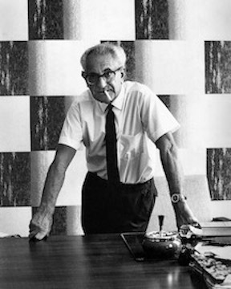
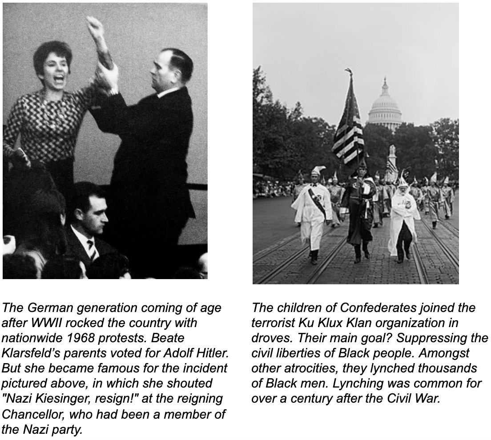
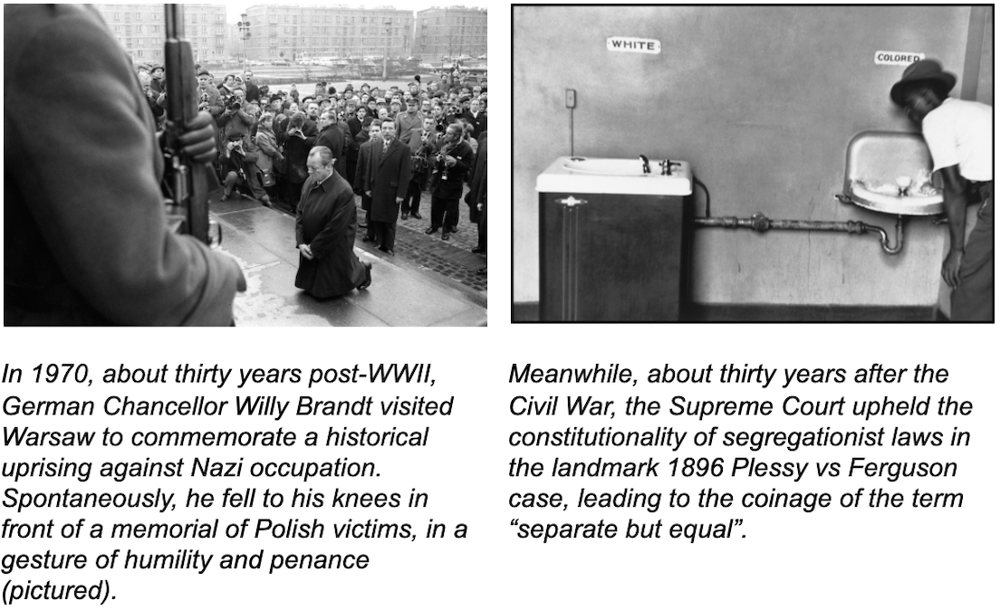
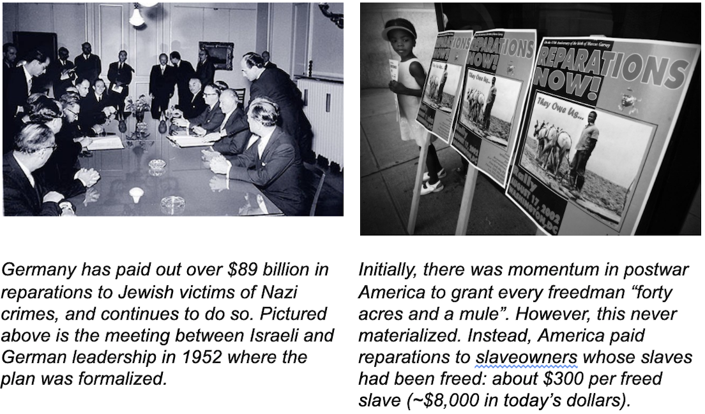
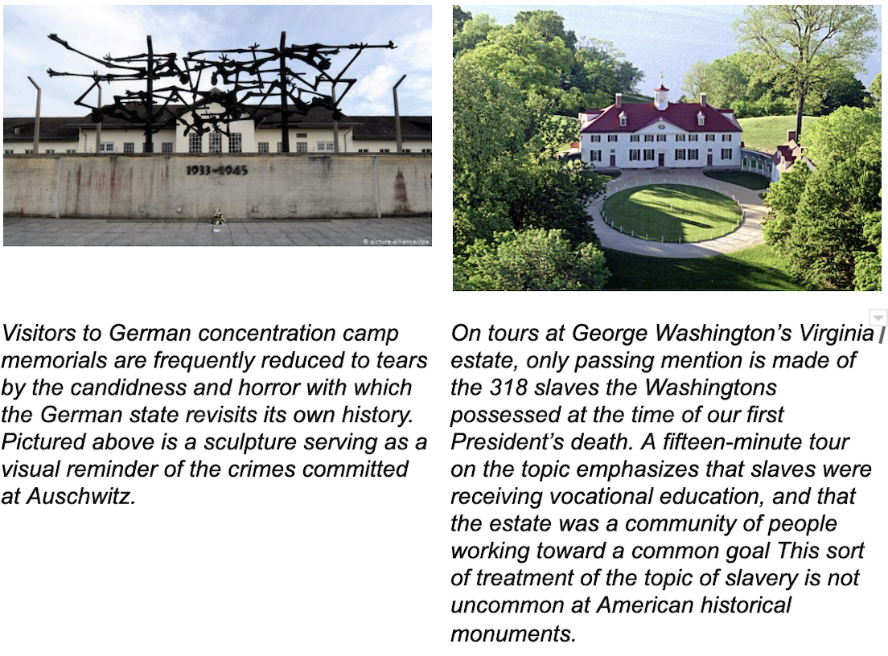
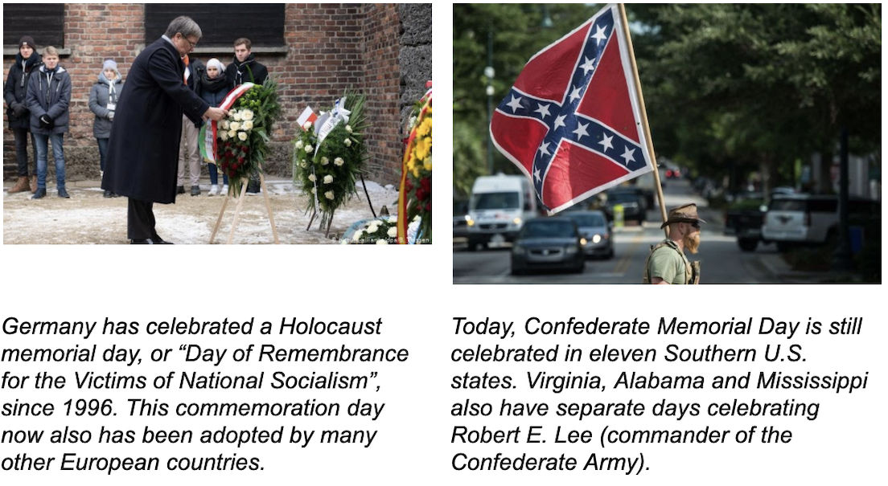

> "America is not unique in its sins as a country. We’re not unique in our evils...I think where we may be singular is our refusal to acknowledge them. And the legends and myths we tell about our inherent, you know, good-ness to hide and cover and conceal so that we can maintain a kind of willful ignorance that protects our innocence." 
>
> _-Princeton Professor Eddie Glaude, commenting on MSNBC in August 2019_

When I was in school, history class just felt like memorizing the dates of supposedly “important” events and the names of dead people. I couldn’t fathom how it could be applicable for my life.

But now, I understand that our interpretation of history is perhaps the single greatest thing that influences our lens on the present: why things are the way they are, what is unjust and what is deserved, what kind of contribution we want to make to the world around us before we go. So I’ve taken it upon myself to invest in a bit of re-education: [These Truths](https://www.goodreads.com/book/show/43726521-these-truths) for a new perspective on U.S. history; [From The Ruins of Empire](https://www.goodreads.com/book/show/13536357-from-the-ruins-of-empire?from_search=true&from_srp=true&qid=HV5mLRL9LZ&rank=1) to better understand Asia’s perspective; Roman Empire history; Indigenous American history; and more.

One of the most helpful practices I’ve developed in my self-education is asking questions. And especially recently, I’ve had a lot of questions about the plight of Black people in America. 

#### Why is police brutality towards Black Americans [normalized](https://www.nature.com/articles/d41586-020-01846-z)? Why are they [more likely](https://www.cbsnews.com/news/black-workers-lives-essential-frontline-jobs-risk-coronavirus-reopening/) to be sent to the frontlines in a crippling pandemic, yet are [least likely](https://www.ncbi.nlm.nih.gov/pmc/articles/PMC5370590/) to have the support of healthcare infrastructure to match this burden? Why does the Black community consistently [rank lower](https://www.ssa.gov/policy/docs/ssb/v64n4/v64n4p1.html) than others on home ownership measures, wealth accumulation, and education levels?

Given our painful two-hundred-year legacy of enslavement, some may feel that our current situation was inevitable. Any nineteenth-century spectator would’ve predicted the ascent from slavery to true equality to be a long, laborious process, right? Maybe it was always going to feel like agonizingly thrusting a boulder up a large hill; starting and stopping, sometimes taking a step back, ever in aspiration of a glimpse over the horizon.

But the inconvenient truth is that it didn’t need to be this way. Other countries have wrestled with painful legacies yet have emerged in a much different place.

Today, class, we’re going to learn about...dun dun dun...**Germany**! 🇩🇪

I’m [not](https://www.newyorker.com/news/q-and-a/how-to-confront-a-racist-national-history) [the](https://www.theguardian.com/commentisfree/2020/jun/13/germany-confronted-racist-legacy-britain-us) [first](newyorker.com/culture/cultural-comment/what-can-we-learn-from-the-germans-about-confronting-our-history) to suggest that America could take a pointer on moving past racism from Germany’s wrangling with Nazism. But stick around...my history lesson comes with _photos._

## Onto the good stuff: a bunch of important events and some names of dead people

At first, post-World-War-Two Germany and post-Civil-War America seemed to chart very similar courses. Both initially prioritized amnesty and integration. 

Neither country aggressively prosecuted leaders of the deposed groups. Although much has been made of the Nurmeburg trials, only twenty-five of the top Nazi officials were put on trial. After the Civil War, no Confederate leaders were prosecuted.

Both countries reinstated Nazi/Confederate leaders into positions of power. 

#### As a result, post-WWII Germany and post-Civil-War America were able to slip their history--and the guilty conscience that may have come with a recognition of it--under the rug. Citizens fell into denial of the sins that had led to war in the first place. 

> “In Germany, the Nuremburg trials were dismissed as ‘Siegerjustiz’: mere revenge taken by the victors upon the vanquished...The prevailing German view became that Nazi crimes were the fault of just a tiny clique of evil individual leaders, and that the vast majority of Germans were innocent."
>
> _-Excerpt from "Upheaval" by Jared Diamond_ 

In America, a narrative unfolded that the Civil War hadn’t been fought over slavery; it was about states’ rights. Instead of a nationwide self-apprisal over our perpetuation of a monstrous human rights violation and the racism this embedded into our consciousness, Southern states were permitted to commit civil rights violations left and right. Southern governmental offices became a revolving door of Ku Klux Klan members.

## Two roads diverged...

Germany was ambling down a path that may have led it to as distraught a position as America is in today. But soon, their route forked.

What happened? Fritz Bauer, a German Jewish lawyer, intervened. Pushing back against significant institutional inertia, verbal attacks, and even death threats, he prosecuted ordinary Germans--not just high-profile leaders--in the late 1950s and early 1960s.

Unlike the Nuremberg trials, he went after minor officials--doctors, judges, low-level guards and police, and foot soldiers.

“In reality, many, perhaps most, of Bauer’s prosecutions failed,” Diamond continues. ”Instead, the significance of Bauer’s work was that he, a German, in German courts, demonstrated to the German public again and again, in excruciating detail, the beliefs and deeds of Germans during the Nazi era. Nazi misdeeds were not just the work of a few bad leaders. Instead, masses of ordinary German soldiers and officials...had carried out Nazi orders, and had therefore been guilty of crimes against humanity.”

#### This reckoning changed the course of Germany. They confronted the painful reality of their history. Americans, well...didn’t.

## Germany vs America: contrasting legacies shown in photos

Of course, Germany is not perfect. Especially recently, some Germans are [concerned](https://www.theatlantic.com/international/archive/2019/04/germany-far-right-holocaust-education-survivors/586357/) that the “culture of [Halocaust] remembrance is crumbling.” An anti-semitic far-right political group has gained some momentum. But still, when [asked in a recent poll](https://www.dw.com/en/germans-want-to-uphold-culture-of-holocaust-remembrance/a-52125596) whether it was time to close the chapter on Nazi crimes, 60% of German respondents said it was important to remember the past.

## “Sure, we screwed the pooch on this one. But that’s just one example, and it was a different time. We’re better at dealing with these things now.”

Nope. We have airbrushed our failures instead of learning from them [time and time again](https://www.history.com/news/reparations-slavery-native-americans-japanese-internment). Just last November, President Trump pardoned three military officers charged with war crimes. These were [not ambiguous cases](https://foreignpolicy.com/2019/05/21/america-loves-excusing-its-war-criminals-trump-pardons/). 

While it may be tempting to blame this on one President, the truth is that Trump’s actions are a manifestation of our true national character. Our inability to hold ourselves accountable extends across every single administration in our history (see: President Obama’s [failure to close Guantanamo Bay](https://www.newyorker.com/magazine/2016/08/01/why-obama-has-failed-to-close-guantanamo)). 

Closure remains out of grasp for Black Americans, yes, but also Native Americans; victims of American war crimes in countries like Vietnam, Iraq and Afghanistan; Japanese Americans interned during World War II; and more.

## So what do we do about it?

As any parent says to a child who’s done something regrettable: it’s normal to make mistakes. What’s most critical is that you apologize for them and make amends. 

“Apologizing and making amends” won’t magically erase pain and suffering. But until we do this, America will always be haunted by the spectre of our past, and regarded as a hypocrite by our global neighbors. This will not just cripple our ability to manifest the promise of our country for its citizens; it will perpetuate the cycle. 

#### After all, those that fail to study history are doomed to repeat it.

Repentance is an ongoing process, and we shouldn’t be seeking silver bullets that will allow us to “move on.” In order to chart a course for what reconciliation, we need to better understand the nature of our sins. We need to weave our failures into the fabric of our historical narratives. 

#### America is based on ideals of reinvention, of always striving for better. We will always falter and fail. How best do we ensure survival and continuous improvement? Simple: by holding our failures up in the light, examining them side-by-side with our successes, and appreciating the reality of both. 

We need to learn to be comfortable with the mixed legacy of figures like George Washington and Thomas Jefferson: we can lament that they were slave-owners till their deaths while also being proud of the indelible torches of freedom and liberty they thrust forward.

Or take Woodrow Wilson. The man was a bonafide racist - amongst many examples I could pull from here, no Black Civil War veterans were permitted to attend the 50th anniversary memorial celebrations of the Battle of Gettysburg during his presidential tenure - but his leadership after World War One heralded a new global era of self-representation and democracy.

History is messy. We should stop trying to wipe it clean. Only in appreciating the complexity of our past will we learn to more thoughtfully create effective antidotes for the issues plaguing our present and future.